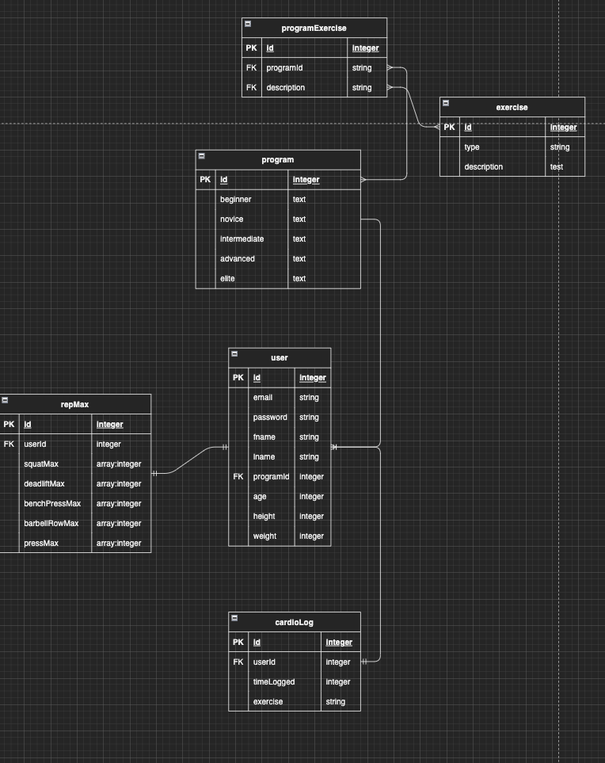

 
<h2>Contents</h2>
<ul>
<li><a href="#description">Description</a></li>
<li><a href="#erd">ERD</a></li>
<li><a href="#api">API</a></li>
<li><a href="#restful-routing-chart">Restful Routing Chart</a></li>
<li><a href="#wireframes">Wireframes</a></li>
<li><a href="#user-stories">User Stories</a></li>
<li><a href="#mvp-goals">MVP Goals</a></li>
<li><a href="#stretch-goals">Stretch Goals</a></li>
 

</ul>

 

 
<h1>Strength Progression App</h1>

<h2 id='description'>Description</h2>

The Strength Progression App is a web application that allows users to track their strength training progress. Users will be able to create an account, log in, and choose a workout program from an opinonated list of workout programs for their level, to align the user with there goals. Users will be able to track their progress by logging their workouts and seeing their progress over time.

<h2 id='api'>API</h2>

API = https://wger.de/en/software/api

<h2 id='restful-routing-chart'>Restful Routing Chart</h2>

| CONTROLLER   |                | MODEL       | VIEW                                                   | Notes                                              |
|--------------|----------------|-------------|--------------------------------------------------------|----------------------------------------------------|
| HTTP Request | URL Path       | CRUD action | HTTP Response                                          |                                                    |
| GET          | /users         | READ        | Array of Objects [{ users }] Status: 200       | List all books. Admin Role                         |
| POST         |                | CREATE      | No data Status: 201 Redirect to /users/login   | Create new User and redirect to login page         |
| GET          | /users/:id     | READ        | Single Object { users } Status:200             | Single user detail page                            |
| PUT/PATCH    |                | UPDATE      | No data Status: 204 Redirect to /users/:id     | Update user record by id                           |
| DELETE       |                | DESTROY     | No data Status: NONE Redirect to /users/new    | Delete user record by id                           |
|              |                |             |                                                        |                                                    |
|              |                |             |                                                        |                                                    |
| CONTROLLER   |                | MODEL       | VIEW                                                   | Notes                                              |
| HTTP Request | URL Path       | CRUD action | HTTP Response                                          |                                                    |
| GET          | /programs      | READ        | Array of Objects [{ programs }] Status: 200    | List all Programs                                  |
| POST         |                | CREATE      | No data Status: 201 Redirect to /programs/:id  | Create new program in programs table               |
| GET          | /programs/:id  | READ        | Single Object { programs } Status:200          | Get single program detail page                     |
| PUT/PATCH    |                | UPDATE      | No data Status: 204 Redirect to /programs/:id  | Update program by id                               |
| DELETE       |                | DESTROY     | No data Status: NONE Redirect to /programs     | Delete program by id                               |
|              |                |             |                                                        |                                                    |
| CONTROLLER   |                | MODEL       | VIEW                                                   | Notes                                              |
| HTTP Request | URL Path       | CRUD action | HTTP Response                                          |                                                    |
| GET          | /cardioLog     | READ        | Array of Objects [{ cardioLog }] Status: 200   | Get all cardioLog                                  |
| POST         |                | CREATE      | No data Status: 201 Redirect to /cardioLog/:id | Create new genre in cardioLog table                |
| GET          | /cardioLog/:id | READ        | Single Object { cardioLog } Status:200         | Get single cardioLog detail page                   |
| PUT/PATCH    |                | UPDATE      | No data Status: 204 Redirect to /cardioLog/:id | Update timeLogged in cardioLog table based on id   |
| DELETE       |                | DESTROY     | No data Status: NONE Redirect to /cardioLog    | Delete timeLogged from cardioLog table based on id |

<h2 id='wireframe'>Lofi Wireframe</h2>

<h2 id='erd'>ERD</h2>

<h2 id='user-stories'>User Stories</h2>

  
As a user I want to be able to create an account so that I can save my progress.

  
As a user I want to be able to log in so that I can save my progress.

  
As a user I want to be able to log out so that I can close the app and log in later.

  
As a user I want to be able to create a profile so that I can can see my progress in charts and visuals that will encourage me to continue eating health and working out.

  
As a user I want to be guided through a program so that I can learn how to lift properly and safely.

  
As a user I want to be able to see my progress so that I can see how far I have come and how much more I have to go.

  
As a user I want to have a range of programs to choose from so that I can find a program that fits my goals.

  
As a user I want a program matched to my level so that I can progress through the program and continue to make maximal gains.

  
As a user I want to have a FAQ so that I can answer any common questions I might have about the app, powerlifting, progression, diet and fitness in general.

  
As a user I want an exercise guide so that I can learn how to do the exercises properly and without injury.

  
As a user I want to know common mistakes so that I can avoid them and continue to make maximal gains.

  
As a user I want to know the importance of recovery so that I can make sure I am fueling my body properly and getting enough rest and recovery to make maximal gains.

  
As a user I want to know what to eat so that I can make sure I am fueling my body properly and getting enough rest and recovery to make maximal gains.

  
As a user I want to be able to calculate my TDEE so that I can make adjustments to the amount of calories I am eating to match my goals.

  
As a user I want to be able to calculate my macros so that I can make adjustments to the amount of calories I am eating to match my goals.

  
As a user I want to be able to reference common charts for powerlifting rankings so that I can see where I stand in the powerlifting community.

  
As a user I want to be able to keep track of my lifts and have charts that tell me what my 1rm and 5rm is so that I can see how much I have progressed.

  
As a user I want to be told what equipment I need in a gym and what equipment I can purchase to create my own home gym so that I can make sure I have the proper equipment to make maximal gains.

  
As a user I want scientific break downs of exercises, diets, cardio and recovery so that I can know that what I am doing is rooted in science.

  
As a user I want professionally written articles that lend credibility to the app so that I can know that what I am doing is rooted in science and that proper research and referencing of scholarly resources is taking place.

<h2 id='mvp-goals'>Mvp Goals</h2>

Create at least two models with Sequelize to query data from database.

Incorporate one api into application.

Implement full CRUD functionality with restful routing.

Use Sequelize ORM to create database structure and interact with.

Include project README.

Write clean, dry code and refactor as needed to deliver professional codebase.

User auth with passport JS implementing token based strategy, or user auth with bcrypt token based strategy

Deploy app online. Provide link in Readme

<h2 id='stretch-goals'>Stretch Goals</h2>

TBD

